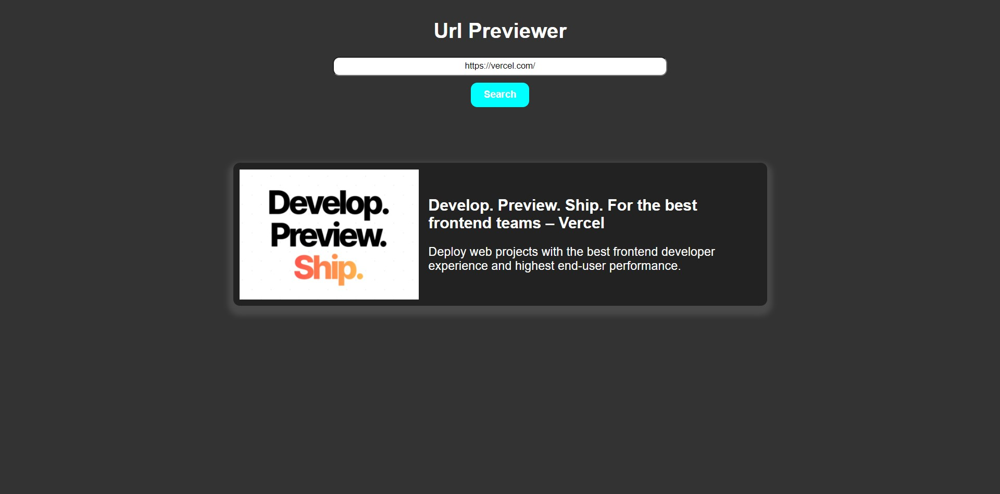

# Url Previwer using python

## Libs used :

- Flask
- Requests
- bs4
- Flask Cors

## Description:

This helps to preview urls. Takes Url as input and returns thumbnail, title, and description of the url.
Backend is made with Flask returns api [GET] `/api/?url=https://bosecode.netlify.app/` .
Frontend is simple javascript ,html and css.

# To setup and run

```
pip install requirements.txt
set FLASK_APP=app.py
flask run

```

## Preview


